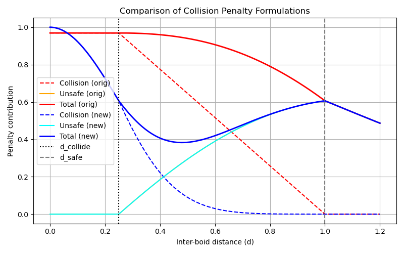

# drone_swarm_simple_sim

A drone swarm simulation derived from boids principles.
A work in progress...

## From Boids to drones

This started as a fork of an implementation of Craig Reynolds' boids, which simulates the flocking behaviour of birds, and evolved as a simulation framework to study / understand drone swarms.
 
*The basic flocking model consists of three simple steering behaviors which describe how an individual boid maneuvers based on the positions and velocities its nearby flockmates:*
- *Separation: steer to avoid crowding local flockmates*
- *Alignment: steer towards the average heading of local flockmates*
- *Cohesion: steer to move toward the average position of local flockmates*

Features added to the original boid simulation:

- takeoff position and formation can be set
- cohesion metric to evaluate the `quality` of the swarm formation
- geo fencing
- messaging and latency, jamming
- waypoint navigation
- ground plane, axis of coordinate system, ... 
- some utilities (capture screenshot, run the simulation for a fixed duration, ...)
- trajectory visualization
- python scripts to analyze cohesion metric, etc...

## Installation

Dependencies (tested on popos 22-24 /  ubuntu 22 - 24)

    sudo apt install libglew-dev
    sudo apt install libgl1-mesa-dev
    sudo apt install libeigen3-dev
    sudo apt install freeglut3-dev

Clone the repository.
```
git clone https://github.com/ThomasParistech/boids.git
```
Build:
```
cd boids
mkdir build
cd build
cmake ..
make -j6
```

The executable is generated in the "bin" directory.

## Running

Go to the build directory and run the app
```
bin/./main
```

## Usage

Get some help

    ./bin/./main -h

Examples of commands to run:

    ./bin/./main --nb_boids 500 --separation 0.02 --cohesion 0.05 --alignment 0.01 --maxspeed 3 --fencerepel 50 --fencesz 50

    ./bin/./main --nb_boids 20 --separation 0.02 --cohesion 0.05 --alignment 0.01 --maxspeed 3 --fencerepel 50 --fencesz 15

    ./bin/./main --nb_boids 50 --separation 0.005 --cohesion 0.2 --alignment 0.3 --maxdist 0.5 --mindist 0.4 --maxspeed 3 --fencerepel 50 --fencesz 15

    ./bin/./main --nb_boids 49 --separation 0.1 --cohesion 1 --alignment 10.3 --maxdist 1.5 --mindist 1.0 --fov 90 --maxspeed 7 --fencesz 50 --targetattract 0.01 --fencerepel 5 --simt 6 --msglat .01 --randf 0.1


Keyboard inputs.

- 's': save screenshot
- add target
- 'ESC' end the simulation
- 'j' jam communication (sudden increase of latency)
- ...

### Python scripts

They are mainly used to develop specific aspect of the swarm, such as cohesion metric.
Example of collision penalty strategy:

 


## simplified code explanation

The main contains the whole simulation application with:
- system initialization (boids, targets, opengl ...)
- system evolution which sets the forces, positions and velocity of the drones and their interaction with objects

All objects are considered "moving object" and the classes inherit from a MovingObject class.

Specific forces to specific objects are defined in their respective classes.

Objects are:
- boids
- targets / waypoints
- obstacles

Boids exchange their position using messenges, which latency can be set. Jamming can be set by a sudden very large increase of latency.

There is also a waypoint manager to deal with navigation through waypoints.

A coehsion metric is proposed to evaluate the degree of cohesion of the swarm as it moves, and the influence of various factors such as message latency, forces weights, etc,... on the swarm's cohesion.

The trajectory of the swarm's center of gravity (COG) can be shown also.

## Other considerations

### Limitations

The simulator doesn't account for the actual physical phenomenas to which real drones are submitted. 
It doesn't account for:
- innacuracy in position (this can be however simply modelled by applying a random noise on the position: TODO)
- aerodymics of flight: no wind, no propeller, etc...
- communication (position exchanged) is highly simplified
- ...

### Messaging

The original boid simulation considered that all each boid has access to all the other boids' position and velocities, instantaneously.

This isn't what happens in a real formation, be it of drones or of animal (in which later case the position of neighbors isn't known at all, birds in a flock don't know the position (x,y,z) of their neighbors but they can evalute how close or far they are).

So I decided to add a messaging logic into the simulation. This is far from being a simple affair...
Problems to solve:
- what date structure to use for the messages, how are messages exchanged between neighbours?
- how to realistically model message? I chose to "consume" message that is once a boid reads messages, they are gone (no resend)
- how to deal with the boid evolution when no message is received (i.e. between the interval time between messages, which essentially corresponds to latency)? 
-

#### Interpolate messages

Instead of releasing a neighbor’s state only when it “arrives”, we keep a  history per neighbor and interpolate/extrapolate to the boid’s current simulation time.
- Store each neighbor’s last known (pos, vel, timestamp).
- When latency = 0.1 (a value i tried), we don’t suddenly jump to the boids (neighbor)  `0.1 - old position`; instead we smoothly interpolate/extrapolate between the two most recent delayed states.
- mimics a realistic communication buffer + prediction scheme.

To be continued...

### Waypoint navigation

Currently uses pre-defined waypoints, and enabled at compile time by the `#define USE_WAYPOINT` directive in main.cpp.

Possible behaviours and tunnings of the swarm w.r.t. waypoints
- adjust waypoint threshold: min turning distance from drone to WP
- behaviour after last WP: 
    - fly over and pursue path ahead
    - back to first WP (will loop)
    - hover over (need some work)
    - land (TODO)
    -

### Cohesion metric

The formula for the area of a circle is $A = \pi r^2$.


## simulation parameters


## References and credits

Original Boid opengl simulation: https://github.com/ThomasParistech/boids

Original boid algorithm: https://www.red3d.com/cwr/boids/

*Dear ImGui* library for the graphical user interface (See https://github.com/ocornut/imgui).


## Modifications to Thomas' code 

- CMakeLists modif so the code runs on ubuntu 22/24
- fix zoom in out with mouse wheel scroll
- Command line argument inputs
- help
- geofencing (sphere or cube), fence repel force weight
- steps on sliders 
- clamp the angular speed
- screenshot (press s), need to copy [stb_image_write.h](https://github.com/nothings/stb) to inc/
- take off randomly, on a line or on a grid (see code to define take-off initial conditions)
- swarm quality metric ( WIP:  defining the quality of a swarm depends on many factors)
- messaging, with latency, and fix lots of related 'strange' swarm behaviours
- press 'b' for top down view
- run a simulation during a fixed time (e.g. to compare cohesion metric evolution as a function of latency)
- add randomness as parameter
- messages: add decay, possibility to disable (with large latency) messaging
- parameter analysis to better understand flock behavior (ex: cohesion is important as well as FOV, sterring also; for large latency a random force is needed to take off)
- messages: add confidence to simulation loss of comm quality
- key press M to sunddenly increase the latency to 6000s (simulate jamming, remove messages)
- update coehsion metric
- waypoints navigation
- maintain cohesion when using waypoints navigation (need some more work!)

## Observations and notes

### sudden increase of latency

There is a slight effect on the final traveled distance, the whole flock behavior is very different from the case where I start the simulation with such a high latency of 6000s. - with latency 0.01, traveled distance after 6s: ~36 - start with latency 0.01, immediately (within 0.5s) press M to increase latency to 6000, traveled distance after 6s: 34.8 - start with latency 0.01, press M at ~3s mark to increase latency to 6000, traveled distance after 6s: 35.56 - with latency = 6000s, traveled distance after 6s: 18.7

Possible explanation:

When starting with a high latency (6000s) the boids never build a useful neighbor history and so never get coordinated (they behave as if isolated).
When starting with low latency (0.01) and then change (key press M) to very high latency, the boids already have recent neighbor state (history, velocities and high confidence). 
That cached information keeps them coordinated for some time (and momentum + alignment already established) 
so the swarm continues to travel almost normally. 

### shape change 

Boids take off from a 7x7 regular grid, with a forward initial velocity and a fixed (i.e. seeded) random velocity. 
For low latency (0.01), the swarm remain tight for the few first seconds then the boids at the leading edge (the front 2 ~3 rows of boids) start spreading away from one another, 
giving rise to a trapezoid shape (large at the front, narrow at the rear); the boids remain rather in an organized manner (regularly spaced within a square at the begining then within a trapezoid at the end of 6s). 
For large latency (10s), the boids are quickly disorganized (irregular spacing) but then remain within a rectangle shape. 
The regular spacing of the boid at low latency is good, but visually the spreading of the leading 2-3 rows of boids and the formation taking a trapezoid shape is a bit puzzling. 

TODO: add screenshots
